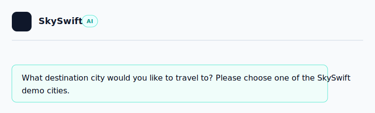

# SkySwift AI

SkySwift AI is a hackathon travel-planning agent that turns a natural chat into a complete trip package. The user talks like a customer, the agent understands destination, dates, interests, and budget, then presents clear itinerary options with flights, hotels, activities, and total price.




## Flow

1. The user starts a chat with SkySwift AI.
2. The agent asks for a destination city.
3. After the destination, the agent suggests activities before asking for budget.
4. The user provides interests, flexible dates, and budget in natural language.
5. OpenRouter helps extract structured trip preferences from the conversation.
6. The planner searches the local travel catalog.
7. The UI shows 3 itinerary options with flight, hotel, activities, price, and match score.
8. The user selects an option and continues toward booking.

## Features

- Chat-first travel planning experience.
- OpenRouter-powered natural language understanding.
- Local fallback parser when the API is unavailable.
- City-based demo destination catalog.
- Natural date parsing, including non-strict formats.
- Streamed assistant responses for a modern chatbot feel.
- Clean itinerary cards with varied activities per option.
- Flight, hotel, activity, total cost, and match score display.
- Optional FastAPI mock server for API-style testing.
- Full pytest coverage for agent, planner, mock server, and integration flow.

## Tech Stack

| Layer | Tech |
| --- | --- |
| UI | Streamlit |
| Agent flow | LangGraph-style state graph |
| LLM provider | OpenRouter |
| Validation | Pydantic |
| Data API | FastAPI mock server |
| HTTP client | HTTPX |
| Tests | Pytest, Hypothesis |

## Project Structure

```text
travel_agent/
  app.py                 Streamlit chat UI
  agent.py               Conversation state and agent flow
  planner.py             Itinerary planning, scoring, and backtracking
  models.py              Pydantic models
  openrouter_client.py   OpenRouter integration
  data/
    static.py            Embedded demo travel catalog
    client.py            Data client with static fallback
    mock_server.py       FastAPI mock API

tests/                   System-level tests
travel_agent/tests/      Package-level tests
docs/                    Project docs and screenshots
scripts/                 Utility scripts
scripts/compat/          Legacy compatibility wrappers
```

## Supported Cities

```text
Tokyo, Paris, Bali, New York, Kyoto, Nice, Rome,
Athens, Bangkok, Barcelona, London, Mexico City, Tel Aviv
```

## Setup

```powershell
python -m venv .venv
.venv\Scripts\python.exe -m pip install -r requirements.txt
```

## Environment Variables

Create a local `.env` file in the project root. Do not commit it.

```text
OPENROUTER_API_KEY=your_key_here
OPENROUTER_ENABLED=true
OPENROUTER_MODEL=openai/gpt-4o-mini
```

SkySwift AI still runs without OpenRouter by using the local parser and static catalog.

## Run The App

```powershell
.venv\Scripts\streamlit.exe run travel_agent\app.py
```

Open:

```text
http://localhost:8501
```

## Optional Mock API Server

The app can run without this server, but it is useful for API-style testing.

```powershell
.venv\Scripts\python.exe -m uvicorn travel_agent.data.mock_server:app --host 127.0.0.1 --port 8000
```

## Tests

```powershell
.venv\Scripts\python.exe -m pytest
```

Current expected result:

```text
119 passed
```

## Hackathon Notes

SkySwift AI is built to demo clearly:

- The first screen is simple and customer-friendly.
- The conversation feels like an AI agent, not a static form.
- The final planning output is visual and easy to compare.
- The project works offline with mock/static data, but can use OpenRouter for smarter conversation.

